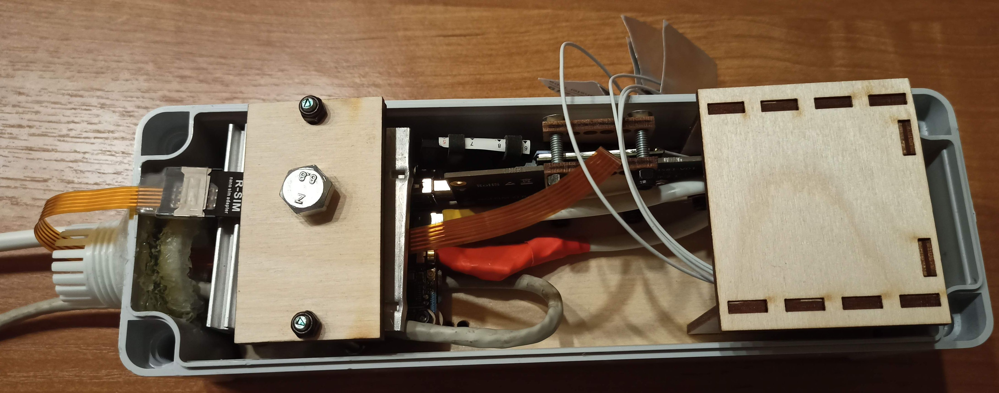
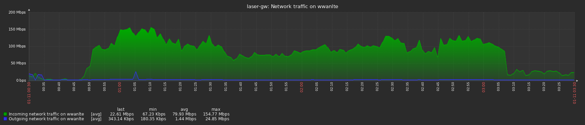

# LTE modem starter
This repository is a pack of scripts to run LTE modem in Linux.






I used:
- [DW5821e](files/IMG_20211207_135448.jpg) [(Dell Wireless 5821e Qualcomm Snapdragon X20 LTE)](files/IMG_20211207_135557.jpg)
- [NGFF M.2 Key B to USB 3.0 Adapter](files/NGFF-M-2-Key-B-to-USB-3-0-Adapter-Expansion-Card-with-SIM-8pin-Card.jpg_Q90.jpg_.webp)
  ([modem installed](files/IMG20211214221537.jpg))
- [SIM card adapter extension cable](https://www.aliexpress.com/item/4000259891941.html)
- [Waterproof Plastic Enclosure Box Electronic ip67](https://aliexpress.com/item/4000287507400.html) ([image](files/Waterproof-Plastic-Enclosure-Box-Electronic-ip67-Project-Instrument-Case-Electrical-Project-Box-ABS-Outdoor-Junction-Box.jpg_640x640.webp))
- [ROCK Pi E D4W1](https://wiki.radxa.com/RockpiE/hardware/models)
- [Armbian Bullseye](https://www.armbian.com/rockpie/)
- PG7 x 2
- PG19
- DC/DC converter
- Heat sink for M.2 SSD
- CNC laser cut [CorelDraw layout](files/Box_-_Rock_Pi_E_-_DW5821e.cdr) ([as image](files/Box_-_Rock_Pi_E_-_DW5821e.png))
- see [all files](files)

## Install
```
# apt install wget libqmi-utils libmbim-utils udhcpc socat
```

Download the following archive to a temporary directory:
```
$ wget https://codeload.github.com/Alexey-Tsarev/LTE_modem_starter/zip/refs/heads/master -O LTE_modem_starter.zip
```

Unzip it:
```
$ unzip LTE_modem_starter.zip
```

Place all files from `etc` and `root` directories to your system as:
```
LTE_modem_starter-master/etc  -> /etc
LTE_modem_starter-master/root -> /root
```

Place/change an example config from `config-examples` folder
(place in the same folder where the `start_LTE_modem.sh` file is).

Reload services (you don't need to enable `LTE-modem-starter` service).
```
# systemctl daemon-reload
```

Reattach your LTE modem (when it connected to a USB port) or reboot your machine and look at logs:
```
tail -n +1 -f /var/log/syslog
```

## Logs example
```
# journalctl -b --no-pager
...
Jan 12 00:06:25 laser-gw udev[1098]: Device: 'Telit_Telit_LN960_Mobile_Broadband_0123456789ABCDEF', path: '/sys/devices/platform/ff600000.usb/xhci-hcd.0.auto/usb5/5-1/bConfigurationValue', current config value: '1'
Jan 12 00:06:25 laser-gw udev[1121]: Write to file: '/var/tmp/LTE-modem-device-path.txt'
Jan 12 00:06:26 laser-gw udev[1129]: Start service: 'LTE-modem-starter'
Jan 12 00:06:27 laser-gw kernel: cdc_mbim 5-1:1.4 wwanlte: renamed from wwan0
```
```
# journalctl -b --no-pager -u LTE-modem-starter
-- Journal begins at Tue 2022-01-11 17:55:32 +04, ends at Wed 2022-01-12 00:08:10 +04. --
Jan 12 00:06:25 laser-gw systemd[1]: Started Run LTE modem.
Jan 12 00:06:25 laser-gw start_LTE_modem.sh[1069]: Attempt: 1
Jan 12 00:06:25 laser-gw start_LTE_modem.sh[1069]: Device: '/sys/devices/platform/ff600000.usb/xhci-hcd.0.auto/usb5/5-1/bConfigurationValue', current config value: '1'
Jan 12 00:06:25 laser-gw start_LTE_modem.sh[1069]: Device config value is already set
Jan 12 00:06:25 laser-gw start_LTE_modem.sh[1069]: Run: echo '1bc7 1911' > /sys/bus/usb-serial/drivers/option1/new_id
Jan 12 00:06:25 laser-gw start_LTE_modem.sh[1069]: Run: sleep 10
Jan 12 00:06:35 laser-gw start_LTE_modem.sh[1069]: Run: TTY_FILE=/dev/ttyUSB2
Jan 12 00:06:35 laser-gw start_LTE_modem.sh[1069]: Run: AT^CUSTOMER?
Jan 12 00:06:36 laser-gw start_LTE_modem.sh[2022]: AT^CUSTOMER?
Jan 12 00:06:36 laser-gw start_LTE_modem.sh[2022]: ^CUSTOMER: 2
Jan 12 00:06:36 laser-gw start_LTE_modem.sh[2022]: OK
Jan 12 00:06:36 laser-gw start_LTE_modem.sh[1069]: Run: AT^SETMODE?
Jan 12 00:06:36 laser-gw start_LTE_modem.sh[2026]: AT^SETMODE?
Jan 12 00:06:36 laser-gw start_LTE_modem.sh[2026]: ^SETMODE:1
Jan 12 00:06:36 laser-gw start_LTE_modem.sh[2026]: OK
Jan 12 00:06:37 laser-gw start_LTE_modem.sh[1069]: Find device
Jan 12 00:06:37 laser-gw start_LTE_modem.sh[1069]: Device: '/dev/cdc-wdm0'
Jan 12 00:06:37 laser-gw start_LTE_modem.sh[1069]: Get interface
Jan 12 00:06:37 laser-gw start_LTE_modem.sh[1069]: Interface: 'wwanlte'
Jan 12 00:06:37 laser-gw start_LTE_modem.sh[1069]: Stop mbim-network at '/dev/cdc-wdm0'
Jan 12 00:06:37 laser-gw start_LTE_modem.sh[2043]: Profile at '/etc/mbim-network.conf' not found...
Jan 12 00:06:37 laser-gw start_LTE_modem.sh[2043]: Stopping network with 'mbimcli -d /dev/cdc-wdm0 --disconnect '...
Jan 12 00:06:37 laser-gw start_LTE_modem.sh[2045]: error: operation failed: ContextNotActivated
Jan 12 00:06:37 laser-gw start_LTE_modem.sh[2043]: Network stop failed
Jan 12 00:06:37 laser-gw start_LTE_modem.sh[2043]: Clearing state at /tmp/mbim-network-state-cdc-wdm0...
Jan 12 00:06:37 laser-gw start_LTE_modem.sh[1069]: Wait for SIM initialization
Jan 12 00:06:38 laser-gw start_LTE_modem.sh[1069]: Start mbim-network at '/dev/cdc-wdm0'
Jan 12 00:06:38 laser-gw start_LTE_modem.sh[2055]: Profile at '/etc/mbim-network.conf' not found...
Jan 12 00:06:38 laser-gw start_LTE_modem.sh[2055]: Querying subscriber ready status 'mbimcli -d /dev/cdc-wdm0 --query-subscriber-ready-status --no-close '...
Jan 12 00:06:38 laser-gw start_LTE_modem.sh[2055]: [/dev/cdc-wdm0] Subscriber ready status retrieved: Ready state: 'initialized' Subscriber ID: '250027367621340' SIM ICCID: '897010273676213408FF' Ready info: 'none' Telephone numbers: (1) '+7' [/dev/cdc-wdm0] Session not closed: TRID: '3'
Jan 12 00:06:38 laser-gw start_LTE_modem.sh[2055]: Saving state at /tmp/mbim-network-state-cdc-wdm0... (TRID: 3)
Jan 12 00:06:38 laser-gw start_LTE_modem.sh[2055]: Querying registration state 'mbimcli -d /dev/cdc-wdm0 --query-registration-state --no-open=3 --no-close '...
Jan 12 00:06:38 laser-gw start_LTE_modem.sh[2055]: [/dev/cdc-wdm0] Registration status: Network error: 'unknown' Register state: 'home' Register mode: 'automatic' Available data classes: 'lte' Current cellular class: 'gsm' Provider ID: '25002' Provider name: 'MegaFon' Roaming text: 'unknown' Registration flags: 'packet-service-automatic-attach' [/dev/cdc-wdm0] Session not closed: TRID: '4'
Jan 12 00:06:38 laser-gw start_LTE_modem.sh[2055]: Saving state at /tmp/mbim-network-state-cdc-wdm0... (TRID: 4)
Jan 12 00:06:38 laser-gw start_LTE_modem.sh[2055]: Attaching to packet service with 'mbimcli -d /dev/cdc-wdm0 --attach-packet-service --no-open=4 --no-close '...
Jan 12 00:06:38 laser-gw start_LTE_modem.sh[2055]: Saving state at /tmp/mbim-network-state-cdc-wdm0... (TRID: 5)
Jan 12 00:06:38 laser-gw start_LTE_modem.sh[2055]: Starting network with 'mbimcli -d /dev/cdc-wdm0 --connect=apn='' --no-open=5 --no-close '...
Jan 12 00:06:38 laser-gw start_LTE_modem.sh[2055]: Network started successfully
Jan 12 00:06:38 laser-gw start_LTE_modem.sh[2055]: Saving state at /tmp/mbim-network-state-cdc-wdm0... (TRID: 7)
Jan 12 00:06:38 laser-gw start_LTE_modem.sh[1069]: Wait for network registration
Jan 12 00:06:39 laser-gw start_LTE_modem.sh[2107]: [/dev/cdc-wdm0] Home provider:
Jan 12 00:06:39 laser-gw start_LTE_modem.sh[2107]:            Provider ID: '25002'
Jan 12 00:06:39 laser-gw start_LTE_modem.sh[2107]:          Provider name: 'MegaFon'
Jan 12 00:06:39 laser-gw start_LTE_modem.sh[2107]:                  State: 'home'
Jan 12 00:06:39 laser-gw start_LTE_modem.sh[2107]:         Cellular class: 'gsm'
Jan 12 00:06:39 laser-gw start_LTE_modem.sh[2107]:                   RSSI: '99'
Jan 12 00:06:39 laser-gw start_LTE_modem.sh[2107]:             Error rate: '99'
Jan 12 00:06:39 laser-gw start_LTE_modem.sh[2107]: [/dev/cdc-wdm0] Session not closed:
Jan 12 00:06:39 laser-gw start_LTE_modem.sh[2107]:             TRID: '1641931600'
Jan 12 00:06:39 laser-gw start_LTE_modem.sh[1069]: Start DHCP client at interface: 'wwanlte'
Jan 12 00:06:39 laser-gw start_LTE_modem.sh[2110]: udhcpc: started, v1.30.1
Jan 12 00:06:39 laser-gw udhcpc[2117]: wwanlte: deconfigured
Jan 12 00:06:39 laser-gw start_LTE_modem.sh[2110]: udhcpc: sending discover
Jan 12 00:06:39 laser-gw start_LTE_modem.sh[2110]: udhcpc: sending select for 10.245.228.46
Jan 12 00:06:39 laser-gw start_LTE_modem.sh[2110]: udhcpc: lease of 10.245.228.46 obtained, lease time 7200
Jan 12 00:06:39 laser-gw udhcpc[2125]: wwanlte: bound: IP=10.245.228.46/255.255.255.252 router=10.245.228.45 domain="" dns="10.112.248.226 10.112.248.250" lease=7200
Jan 12 00:06:39 laser-gw start_LTE_modem.sh[2126]: 4: wwanlte: <BROADCAST,MULTICAST,NOARP,UP,LOWER_UP> mtu 1500 qdisc fq_codel state UNKNOWN group default qlen 1000
Jan 12 00:06:39 laser-gw start_LTE_modem.sh[2126]:     link/ether 7e:0b:fd:b2:d3:ae brd ff:ff:ff:ff:ff:ff
Jan 12 00:06:39 laser-gw start_LTE_modem.sh[2126]:     inet 10.245.228.46/30 brd 10.245.228.47 scope global wwanlte
Jan 12 00:06:39 laser-gw start_LTE_modem.sh[2126]:        valid_lft forever preferred_lft forever
Jan 12 00:06:39 laser-gw start_LTE_modem.sh[1069]: Run: AT^DEBUG?
Jan 12 00:06:39 laser-gw start_LTE_modem.sh[2130]: AT^DEBUG?
Jan 12 00:06:39 laser-gw start_LTE_modem.sh[2130]: RAT:LTE
Jan 12 00:06:39 laser-gw start_LTE_modem.sh[2130]: EARFCN(DL/UL): 3048/21048
Jan 12 00:06:39 laser-gw start_LTE_modem.sh[2130]: BAND: 7
Jan 12 00:06:39 laser-gw start_LTE_modem.sh[2130]: BW: 20.0 MHz
Jan 12 00:06:39 laser-gw start_LTE_modem.sh[2130]: PLMN: 250 02
Jan 12 00:06:39 laser-gw start_LTE_modem.sh[2130]: TAC: 6420
Jan 12 00:06:39 laser-gw start_LTE_modem.sh[2130]: eNB ID(PCI): 645413-4(130)
Jan 12 00:06:39 laser-gw start_LTE_modem.sh[2130]: ESM CAUSE: 0
Jan 12 00:06:39 laser-gw start_LTE_modem.sh[2130]: EMM CAUSE: -1
Jan 12 00:06:39 laser-gw start_LTE_modem.sh[2130]: DRX: 1280ms
Jan 12 00:06:39 laser-gw start_LTE_modem.sh[2130]: RSRP: -71.6dBm rx_diversity: 3 (-78.5dBm,-71.6dBm,-256.0dBm,-256.0dBm)
Jan 12 00:06:39 laser-gw start_LTE_modem.sh[2130]: RSRQ: -8.8dB
Jan 12 00:06:39 laser-gw start_LTE_modem.sh[2130]: RSSI: -42.9dBm
Jan 12 00:06:39 laser-gw start_LTE_modem.sh[2130]: L2W:  -118
Jan 12 00:06:39 laser-gw start_LTE_modem.sh[2130]: RI: 1
Jan 12 00:06:39 laser-gw start_LTE_modem.sh[2130]: CQI:  9
Jan 12 00:06:39 laser-gw start_LTE_modem.sh[2130]: RS-SNR: 10dB
Jan 12 00:06:39 laser-gw start_LTE_modem.sh[2130]: STATUS: SRV/SERVICE_REQUEST_INITIATED
Jan 12 00:06:39 laser-gw start_LTE_modem.sh[2130]: SUB STATUS: NORMAL_SERVICE
Jan 12 00:06:39 laser-gw start_LTE_modem.sh[2130]: RRC Status: WAIT_RRC_CONFIRM
Jan 12 00:06:39 laser-gw start_LTE_modem.sh[2130]: SVC: CS_PS
Jan 12 00:06:39 laser-gw start_LTE_modem.sh[2130]: Tx Pwr: -
Jan 12 00:06:39 laser-gw start_LTE_modem.sh[2130]: TMSI: 161174237230
Jan 12 00:06:39 laser-gw start_LTE_modem.sh[2130]: IP: 10.245.228.46
Jan 12 00:06:39 laser-gw start_LTE_modem.sh[2130]: AVG RSRP: -71.6dBm
Jan 12 00:06:39 laser-gw start_LTE_modem.sh[2130]: OK
Jan 12 00:06:40 laser-gw start_LTE_modem.sh[1069]: Run: AT^CA_INFO?
Jan 12 00:06:40 laser-gw start_LTE_modem.sh[2136]: AT^CA_INFO?
Jan 12 00:06:40 laser-gw start_LTE_modem.sh[2136]: PCC info: Band is LTE_B7, Band_width is 20.0 MHz
Jan 12 00:06:40 laser-gw start_LTE_modem.sh[2136]: SCC1 info: Band is LTE_B7, Band_width is 20.0 MHz
Jan 12 00:06:40 laser-gw start_LTE_modem.sh[2136]: SCC2 info: Band is LTE_B3, Band_width is 10.0 MHz
Jan 12 00:06:40 laser-gw start_LTE_modem.sh[2136]: OK
Jan 12 00:06:40 laser-gw start_LTE_modem.sh[1069]: Run: AT^USBTYPE?
Jan 12 00:06:40 laser-gw start_LTE_modem.sh[2153]: AT^USBTYPE?
Jan 12 00:06:40 laser-gw start_LTE_modem.sh[2153]: ^USBTYPE: USB3.0
Jan 12 00:06:40 laser-gw start_LTE_modem.sh[2153]: OK
Jan 12 00:06:41 laser-gw start_LTE_modem.sh[1069]: Run: AT^TEMP?
Jan 12 00:06:41 laser-gw start_LTE_modem.sh[2165]: AT^TEMP?
Jan 12 00:06:41 laser-gw start_LTE_modem.sh[2165]: PA: 25C
Jan 12 00:06:41 laser-gw start_LTE_modem.sh[2165]: TSENS: 28C
Jan 12 00:06:41 laser-gw start_LTE_modem.sh[2165]: OK
Jan 12 00:06:41 laser-gw systemd[1]: LTE-modem-starter.service: Succeeded.
Jan 12 00:06:41 laser-gw systemd[1]: LTE-modem-starter.service: Consumed 1.014s CPU time.
```
---
Good luck!  
Alexey Tsarev  
https://alexey-tsarev.github.io  
Tsarev.Alexey at gmail.com
